<div align="center">

# 🚀 ServiceNow MCP Server - Quickstart Guide

**Get up and running with ServiceNow automation in minutes**

</div>

---

## 📋 Table of Contents

- [Project Roadmap](#-project-roadmap)
- [Prerequisites](#-prerequisites)
- [Installation](#-installation)
- [Configuration](#-configuration)
- [Integration Options](#-integration-options)
- [Your First Automation](#-your-first-automation)
- [Tool Discovery](#-tool-discovery)
- [Complete Examples](#-complete-examples)
- [Troubleshooting](#-troubleshooting)

---

## 🗺️ Project Roadmap

```mermaid
graph TD
    A[📦 Install snow-mcp] --> B{Choose Integration}
    B -->|AI Agent| C[🤖 Claude Desktop]
    B -->|Python Script| D[💻 FastMCP Client]
    B -->|Custom App| E[🔧 Custom Integration]
    
    C --> F[Configure Claude]
    D --> G[Write Python Script]
    E --> H[Implement MCP Protocol]
    
    F --> I[🔐 Set Credentials]
    G --> I
    H --> I
    
    I --> J[✅ Verify Connection]
    J --> K[🎯 Start Automating]
    
    K --> L[📋 Incident Management]
    K --> M[🔄 Change Management]
    K --> N[👥 User Management]
    K --> O[🛒 Service Catalog]
    K --> P[📊 Agile & Projects]
    
    style A fill:#4CAF50,color:#fff
    style K fill:#2196F3,color:#fff
    style I fill:#FF9800,color:#fff
```



### 🎯 Quick Navigation Path

| If you want to... | Go to Section |
|-------------------|---------------|
| Use with Claude Desktop | [Claude Desktop Integration](#-claude-desktop-integration) |
| Write Python automation scripts | [Python Client Usage](#-python-client-usage) |
| See what tools are available | [Tool Discovery](#-tool-discovery) |
| Learn by example | [Complete Examples](#-complete-examples) |
| Fix connection issues | [Troubleshooting](#-troubleshooting) |

---

## ✅ Prerequisites

Before you begin, ensure you have:

- ✅ **Python 3.8+** installed
- ✅ **ServiceNow instance** with API access
- ✅ **Valid credentials** with appropriate roles
- ✅ **Network access** to your ServiceNow instance

### Required ServiceNow Roles

| Role | Purpose | Operations Enabled |
|------|---------|-------------------|
| `itil` | ITSM Operations | Incidents, Changes, Requests |
| `catalog_admin` | Catalog Management | Service Catalog, Items |
| `user_admin` | User Management | Users, Groups, Roles |
| `admin` | Full Access | All Administrative Operations |

---

## 📦 Installation

### Step 1: Create Virtual Environment (Recommended)

```bash
# Create virtual environment
python -m venv venv

# Activate it
# On macOS/Linux:
source venv/bin/activate

# On Windows:
venv\Scripts\activate
```

### Step 2: Install the Package

```bash
pip install snow-mcp
```

### Step 3: Verify Installation

```bash
snow-mcp --list-tools
```

You should see a list of 106 available tools.

---

## 🔐 Configuration

### Option 1: Environment Variables (Recommended)

Create a `.env` file in your project directory:

```env
SERVICENOW_INSTANCE=https://your-instance.service-now.com
SERVICENOW_USERNAME=your-api-username
SERVICENOW_PASSWORD=your-api-password
```

### Option 2: System Environment Variables

**macOS/Linux:**
```bash
export SERVICENOW_INSTANCE="https://your-instance.service-now.com"
export SERVICENOW_USERNAME="your-api-username"
export SERVICENOW_PASSWORD="your-api-password"
```

**Windows:**
```cmd
set SERVICENOW_INSTANCE=https://your-instance.service-now.com
set SERVICENOW_USERNAME=your-api-username
set SERVICENOW_PASSWORD=your-api-password
```

### Option 3: Direct Configuration (Less Secure)

Pass credentials directly in your integration config (see integration sections below).

---

## 🔌 Integration Options

### 🤖 Claude Desktop Integration

Transform your ServiceNow experience with AI-powered automation through Claude Desktop.

#### Configuration Steps

**1. Locate Claude Desktop Config File:**

- **macOS:** `~/Library/Application Support/Claude/claude_desktop_config.json`
- **Windows:** `%APPDATA%\Claude\claude_desktop_config.json`

**2. Add ServiceNow MCP Server:**

```json
{
  "mcpServers": {
    "servicenow": {
      "command": "snow-mcp",
      "args": [],
      "env": {
        "SERVICENOW_INSTANCE": "https://your-instance.service-now.com",
        "SERVICENOW_USERNAME": "your-username",
        "SERVICENOW_PASSWORD": "your-password"
      }
    }
  }
}
```

**3. Restart Claude Desktop**

Completely close and reopen Claude Desktop.

**4. Test the Integration**

Ask Claude:
> "What ServiceNow tools are available?"

#### What You Can Do with Claude

**Incident Management:**
- *"Create a high-priority incident for database server outage"*
- *"Show me all open incidents assigned to the network team"*
- *"Add a work note to incident INC0010001"*
- *"Resolve incident INC0010001 with resolution notes"*

**Change Management:**
- *"Create a change request for patching web servers next weekend"*
- *"List all pending change approvals"*
- *"Approve change CHG0040001"*

**User Management:**
- *"Create a new user account for John Doe"*
- *"Add user john.doe to the Database Administrators group"*
- *"Show me all inactive users"*

**Analytics:**
- *"Show me incident statistics grouped by priority"*
- *"Generate a report of all changes implemented last month"*

---

### 💻 Python Client Usage

Build custom automation scripts using the FastMCP client library.

#### Basic Setup

```python
import asyncio
import os
from fastmcp import Client

# Load credentials
SERVICENOW_CREDS = {
    "instance_url": os.getenv("SERVICENOW_INSTANCE"),
    "username": os.getenv("SERVICENOW_USERNAME"),
    "password": os.getenv("SERVICENOW_PASSWORD")
}

# Initialize MCP client
client = Client({
    "mcpServers": {
        "servicenow": {
            "command": "snow-mcp",
            "args": [],
            "transport": "stdio"
        }
    }
})
```

#### Making Tool Calls

Every tool call requires a payload with `params` containing credentials and tool-specific arguments:

```python
async def create_incident_example():
    payload = {
        "params": {
            **SERVICENOW_CREDS,
            "short_description": "Network switch offline",
            "impact": "1",
            "urgency": "1",
            "category": "Network"
        }
    }
    
    result = await client.call_tool("create_incident", payload)
    print(f"Created incident: {result['number']}")

# Run it
asyncio.run(create_incident_example())
```

---

## 🔍 Tool Discovery

### List All Available Tools

```bash
snow-mcp --list-tools
```

### Tool Categories

The server provides 106 tools organized into these categories:

#### 📋 **Incident Management**
- `create_incident` - Create new incidents
- `update_incident` - Update existing incidents
- `get_incident_by_number` - Retrieve incident details
- `add_comment_to_incident` - Add customer comments
- `add_work_notes_to_incident` - Add internal notes

#### 🔄 **Change Management**
- `create_change_request` - Create change requests
- `update_change_request` - Update changes
- `list_change_requests` - Query changes
- `approve_change` - Approve changes
- `reject_change` - Reject changes
- `add_change_task` - Add tasks to changes

#### 👥 **User & Group Management**
- `create_user` - Create user accounts
- `get_user` - Retrieve user information
- `create_group` - Create groups
- `add_group_members` - Add users to groups
- `remove_group_members` - Remove users from groups

#### 🛒 **Service Catalog**
- `list_catalog_items` - Browse catalog
- `submit_catalog_request` - Order items
- `get_requested_item` - Check request status
- `create_catalog_item_variable` - Add catalog fields

#### 📊 **Agile & Projects**
- `create_story` - Create user stories
- `create_epic` - Create epics
- `create_scrum_task` - Create tasks
- `create_project` - Create projects
- `update_story` - Update stories

#### 🏗️ **CMDB Management**
- `list_ci_classes` - List CMDB CI classes
- `get_ci` / `list_cis` - Retrieve configuration items
- `create_ci` / `update_ci` - Create and update CIs
- `get_ci_relationships` - Query CI relationships

#### 🐛 **Problem Management**
- `create_problem` / `update_problem` - Manage problem records
- `list_problems` / `get_problem` - Query problems
- `create_known_error` - Mark as known error with workaround

#### ⏱️ **SLA Management**
- `list_sla_definitions` - List SLA definitions
- `get_task_sla` - Get SLAs for a task
- `list_breached_slas` - Find breached SLAs

#### 🔧 **General Operations**
- `get_records_from_table` - Query any table
- `get_table_schema` - Get table structure
- `search_records_by_text` - Full-text search
- `create_record` / `update_record` / `delete_record` - Generic CRUD
- `batch_update_records` - Batch update multiple records
- `attach_file_to_record` - Attach files
- `get_aggregate_data` - Analytics & reporting

---

## 🎯 Your First Automation

### Example 1: Create and Resolve an Incident

```python
import asyncio
import os
from fastmcp import Client

SERVICENOW_CREDS = {
    "instance_url": os.getenv("SERVICENOW_INSTANCE"),
    "username": os.getenv("SERVICENOW_USERNAME"),
    "password": os.getenv("SERVICENOW_PASSWORD")
}

async def incident_workflow():
    client = Client({
        "mcpServers": {
            "servicenow": {
                "command": "snow-mcp",
                "args": [],
                "transport": "stdio"
            }
        }
    })
    
    # 1. Create incident
    create_payload = {
        "params": {
            **SERVICENOW_CREDS,
            "short_description": "Email server not responding",
            "description": "Users cannot access email",
            "impact": "2",
            "urgency": "1",
            "category": "Software"
        }
    }
    
    incident = await client.call_tool("create_incident", create_payload)
    incident_sys_id = incident["sys_id"]
    print(f"✅ Created: {incident['number']}")
    
    # 2. Add work notes
    notes_payload = {
        "params": {
            **SERVICENOW_CREDS,
            "sys_id": incident_sys_id,
            "notes": "Checked server. Email service was stopped."
        }
    }
    
    await client.call_tool("add_work_notes_to_incident", notes_payload)
    print("📝 Added work notes")
    
    # 3. Resolve incident
    resolve_payload = {
        "params": {
            **SERVICENOW_CREDS,
            "sys_id": incident_sys_id,
            "state": "6",  # Resolved
            "resolution_notes": "Restarted email service. Issue resolved."
        }
    }
    
    await client.call_tool("update_incident", resolve_payload)
    print("✅ Incident resolved")

if __name__ == "__main__":
    asyncio.run(incident_workflow())
```

### Example 2: User Provisioning

```python
async def provision_new_user():
    client = Client({
        "mcpServers": {
            "servicenow": {
                "command": "snow-mcp",
                "args": [],
                "transport": "stdio"
            }
        }
    })
    
    # Create user
    user_payload = {
        "params": {
            **SERVICENOW_CREDS,
            "first_name": "Jane",
            "last_name": "Smith",
            "user_name": "jane.smith",
            "email": "jane.smith@company.com",
            "title": "Software Engineer"
        }
    }
    
    user = await client.call_tool("create_user", user_payload)
    print(f"✅ Created user: {user['user_name']}")
    
    # Add to group
    group_payload = {
        "params": {
            **SERVICENOW_CREDS,
            "group_sys_id": "your_group_sys_id",
            "user_sys_ids": [user["sys_id"]]
        }
    }
    
    await client.call_tool("add_group_members", group_payload)
    print("✅ Added user to group")
```

### Example 3: Analytics Report

```python
async def incident_analytics():
    client = Client({
        "mcpServers": {
            "servicenow": {
                "command": "snow-mcp",
                "args": [],
                "transport": "stdio"
            }
        }
    })
    
    # Get incident counts by priority and state
    analytics_payload = {
        "params": {
            **SERVICENOW_CREDS,
            "table_name": "incident",
            "aggregation_function": "COUNT",
            "group_by_fields": ["priority", "state"],
            "query": "active=true"
        }
    }
    
    result = await client.call_tool("get_aggregate_data", analytics_payload)
    print("📊 Incident Statistics:")
    print(result)
```

---

## 🛠️ Troubleshooting

### Issue: "snow-mcp command not found"

**Solution 1:** Use Python module execution
```json
{
  "mcpServers": {
    "servicenow": {
      "command": "python",
      "args": ["-m", "servicenow_mcp_server"],
      "env": { ... }
    }
  }
}
```

**Solution 2:** Use full Python path
```json
{
  "mcpServers": {
    "servicenow": {
      "command": "/usr/local/bin/python3",
      "args": ["-m", "servicenow_mcp_server"],
      "env": { ... }
    }
  }
}
```

### Issue: Authentication Errors

1. ✅ Verify credentials work in ServiceNow web interface
2. ✅ Check instance URL format (must include `https://`)
3. ✅ Ensure API access is enabled for your user
4. ✅ Verify required roles are assigned

### Issue: Server Not Appearing in Claude

1. ✅ Check config file syntax (valid JSON)
2. ✅ Restart Claude Desktop completely
3. ✅ Check Claude Desktop logs for errors
4. ✅ Test server manually: `snow-mcp --list-tools`

### Issue: Rate Limiting

The server includes built-in retry logic with exponential backoff. If you encounter rate limits:

1. Reduce request frequency
2. Use batch operations where possible
3. Contact ServiceNow admin to review rate limits

---

## 🔐 Security Best Practices

- ✅ **Use service accounts** with minimal required permissions
- ✅ **Store credentials securely** using environment variables or secret managers
- ✅ **Rotate passwords regularly** (every 90 days recommended)
- ✅ **Monitor API usage** through ServiceNow logs
- ✅ **Restrict network access** to authorized IPs when possible
- ✅ **Never commit credentials** to version control
- ✅ **Use HTTPS only** for all ServiceNow connections

---

## 📚 Additional Resources

### Documentation
- **Tool Reference:** See complete tool documentation in this guide
- **API Documentation:** [ServiceNow REST API Docs](https://developer.servicenow.com/dev.do)
- **FastMCP Framework:** [FastMCP Documentation](https://gofastmcp.com/)

### Support
- **GitHub Issues:** Report bugs and request features
- **ServiceNow Community:** Get help from ServiceNow experts
- **MCP Protocol:** [Model Context Protocol Specification](https://modelcontextprotocol.io)

---

## 🎓 Next Steps

Now that you're set up, explore these advanced topics:

1. **Workflow Automation** - Chain multiple operations together
2. **Error Handling** - Implement robust error handling
3. **Batch Operations** - Process multiple records efficiently
4. **Custom Integrations** - Build your own MCP clients
5. **CI/CD Integration** - Automate ServiceNow in your pipelines

---

<div align="center">

**🎉 You're all set! Start automating ServiceNow operations now.**

**Questions?** Check the [Troubleshooting](#-troubleshooting) section or open an issue on GitHub.

---

**Made with ❤️ by Sourojit Dhua**

</div>
